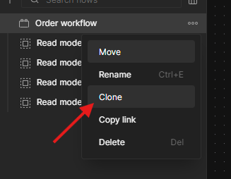
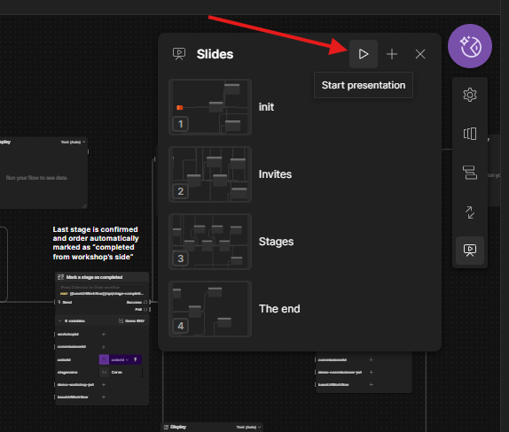

# Run the services
## Options:
#### To run the stack:
- DockerCompose with Redis as MQ (800MB pull): 2 services (200 MB each), Redis (50 MB), Postgres (400 MB).

> You can also run it with intended Kafka as MQ (2 GB pull) - I will provide a command for that. However, lightweight KRaft images refuse to set up properly. As I am fixing this, the only current option is to run it with Zookeeper (1.5 GB pull total). Apologize for the inconvenience.
>Run only if you want to try out [graceful degradation fallback modes](./kafka-failure-mode.md) yourself.

### To access API: 
- Postman flow: smoothest option, but requires postman setup (2 min). Has a one-click run of the entire workflow with a fancy UI.
- Swagger UI: built-in, no setup, but not very convenient to run the whole workflow - some copypasting needed.
Recommendation: try both; Postman for integral workflow overview, Swagger for playing around with endpoints.

------------
### DockerCompose:

This assumes Docker is set up on your machine:
1. Download the [DockerCompose file](../../docker-compose.yaml).
2. Run:
```
   docker compose --profile infra-nokafka --profile apps-redis up -d
```

3. **To kill the services**:
```
docker compose --profile infra-nokafka --profile apps-redis down
```

### See the logs:
#### UI:
You can access a demo UI with logs here:
[localhost:8085](http://localhost:8085)

#### Console:
**Order-service:**
```
docker container logs artisan-atlas-demo-order-service-redis-1
```

**Bonus-service:**
```
docker container logs artisan-atlas-demo-bonus-service-redis-1
```


#### Optional:
You can use those commands to run the Kafka version and bring it down respectively:

```
docker compose --profile infra-all --profile apps-kafka up -d
```

```
docker compose --profile infra-all --profile apps-kafka down
```

### Swagger UI:

##### Just open those in you browser:

| Order-service (workflow) | [localhost:3001/docs](http://localhost:3001/docs) |
| ------------------------ | ------------------------------------------ |
| Order-service (read)     | [localhost:3002/docs](http://localhost:3001/docs) |
|                          |                                            |
| Bonus-service (read)     | [localhost:3004/docs](http://localhost:3004/docs) |

##### How to complete the workflow:
- The endpoints are listed top-to-bottom in the order you should call them (except `decline`).
- Once you run `POST /api/order`, you will get `orderId` as an output. You will have to copy it and paste into each consequent request manually.
- 


> Auth and ownership validation ("anti-confused-deputy") are present in the app, but disabled for demo convenience - otherwise you would have to swap tokens on each request manually.

### Postman flow:

1. Install [Postman] on your machine (localhost cannot be accessed from within browser).
2. Follow here: [Flow](https://www.postman.com/artisan-atlas/artisan-atlas/flow/68c39dacd0954f00138c7fa7), then click `clone` and choose any target workspace.



3. Click `import` and pick/drop this: [Postman ENV](../../assets/Demo-ENV.postman_environment.json)


4. Open `Flows`, select `Order-workflow`. Now you should set `Demo ENV` on any window. A prompt will appear suggesting to set the same on all requests - you agree.


5. Click `Run`.
6. Optional: click `start presentation` to browse pre-selected views.



------------
## Notes on endpoints:

### Order-service:
- To read the current state of the workflow open the [order read model](http://localhost:3001/docs) window. It's auto-refreshed every 10 seconds, but you may refresh it manually with the `/refresh` endpoint. Don't forget to specify the query via parameters.
- `POST /api/cancel` can be run at any step, but the result will differ. 
-  You may play around with stages proposed in `POST /api/workshop-invitation/accept`. Each stage adds 1-2 additional transitions in the workflow.
### Bonus-service:
- Equivalently, to check out the state open the [bonus read model](localhost:3004/docs). It works the same way as that of order-service.
